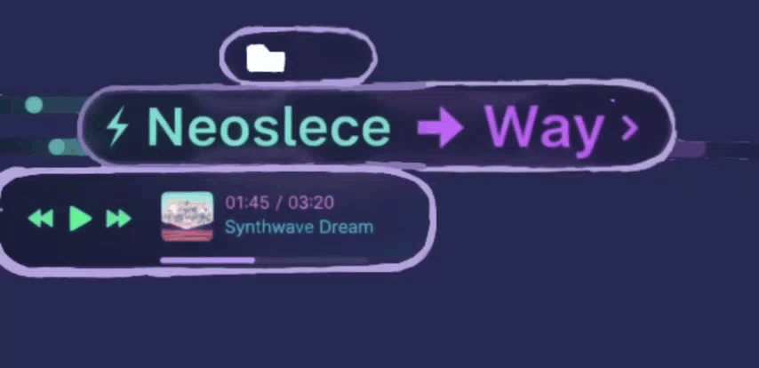

<h1>🟣 NeoSleceWay</h1>

NeoSleceWay es un <strong>panel superior minimalista y moderno para Waybar</strong>, diseñado para usuarios de <strong>Sway/Hyprland</strong>. Centraliza música, sistema y aplicaciones con diseño elegante, colores translúcidos y bordes redondeados.

<h2>🚀 Características Principales</h2>

<h3>💻 Sistema</h3>
<ul>
    <li>Red Wi-Fi con SSID visible y gestión desde Waybar</li>
    <li>Controles de volumen integrados</li>
    <li>Brillo de pantalla ajustable</li>
    <li>Notificaciones desplegables</li>
    <li>Reloj y fecha con estilo</li>
</ul>

<h3>🎵 Música</h3>
<ul>
    <li>Carátula de la canción actual (actualización automática)</li>
    <li>Botones: Anterior, Reproducir/Pausar, Siguiente</li>
    <li>Tiempo restante de la canción</li>
    <li>Título y artista de la canción</li>
    <li>⚠️ Importante: Los scripts dentro de <code>~/.config/waybar/scripts/</code> son críticos:
        <ul>
            <li>No modificar: <code>memory.py</code>, <code>update_cover.py</code>, <code>playerctl.py</code></li>
            <li>Alterarlos puede romper la actualización de carátulas y controles de música</li>
            <li>Siempre hacer <strong>backup</strong> antes de cualquier cambio</li>
        </ul>
    </li>
</ul>

<h3>📋 Clipboard / Portapapeles</h3>
<ul>
    <li>Visualiza imágenes y texto</li>
    <li>Copia al portapapeles con un clic</li>
    <li>Vaciar portapapeles desde Rofi</li>
</ul>

<h3>⚙️ Configuración de Módulos</h3>
<ul>
    <li>Activa o desactiva:
        <ul>
            <li>Visualizador de audio (CAVA)</li>
            <li>Controles de música</li>
            <li>Notificaciones</li>
            <li>Workspaces</li>
        </ul>
    </li>
    <li>Personalización fácil vía Rofi</li>
</ul>

<h3>🖼 Wallpapers</h3>
<ul>
    <li>Selección y previsualización de fondos desde Rofi</li>
    <li>Compatible con imágenes <code>.jpg</code>, <code>.png</code>, <code>.jpeg</code></li>
    <li>Cambia el wallpaper automáticamente con <code>aww</code></li>
</ul>

<h2>📂 Funciones por Script</h2>
<table>
    <thead>
        <tr>
            <th>Script</th>
            <th>Función</th>
        </tr>
    </thead>
    <tbody>
        <tr><td>cava.py</td><td>Visualizador de audio con barras híbridas vertical/lateral</td></tr>
        <tr><td>playerctl.py</td><td>Control de música: play/pause, next, previous</td></tr>
        <tr><td>update_cover.py</td><td>Actualiza automáticamente la carátula de la canción</td></tr>
        <tr><td>wifi_manager.sh</td><td>Escaneo y conexión Wi-Fi, olvidar redes</td></tr>
        <tr><td>clipboard.sh</td><td>Gestión de portapapeles, previsualización de imágenes/texto</td></tr>
        <tr><td>notes.sh</td><td>Crear, editar y eliminar notas rápidas</td></tr>
        <tr><td>wallpapers.sh</td><td>Gestión y cambio de wallpapers desde Rofi</td></tr>
    </tbody>
</table>

<h2>🎨 Estética</h2>
<ul>
    <li>Bordes redondeados y fondo translúcido</li>
    <li>Tema inspirado en <strong>Catppuccin Mocha</strong></li>
    <li>Animaciones suaves y deslizamiento de elementos</li>
    <li>Fuente: <strong>DaddyTimeMono Nerd Font</strong></li>
</ul>

<h2>⚡ Instalación</h2>
<pre>
git clone https://github.com/tuusuario/NeoSleceWay.git ~/.config/waybar
chmod +x ~/.config/waybar/scripts/*.sh
chmod +x ~/.config/waybar/scripts/*.py
</pre>

- Configura tus <code>temas CSS</code>

- Personaliza <code>~/.config/cava/config_waybar</code> si quieres ajustes visuales del visualizador

- Inicia Waybar y los scripts se integrarán automáticamente

<h2>📦 Dependencias</h2>
<pre>
sudo apt install cava rofi nmcli wl-clipboard pavucontrol aww playerctl mousepad
</pre>
<ul>
    <li><code>cava</code> → Visualización de audio</li>
    <li><code>rofi</code> → Menús y selección</li>
    <li><code>nmcli</code> → Gestión de redes</li>
    <li><code>wl-clipboard</code> → Portapapeles Wayland</li>
    <li><code>pavucontrol</code> → Control de volumen</li>
    <li><code>aww</code> → Cambiar wallpapers en Wayland</li>
    <li><code>playerctl</code> → Controlar reproductores</li>
    <li><code>mousepad</code> → Editor de notas</li>
</ul>

</body>
</html>
