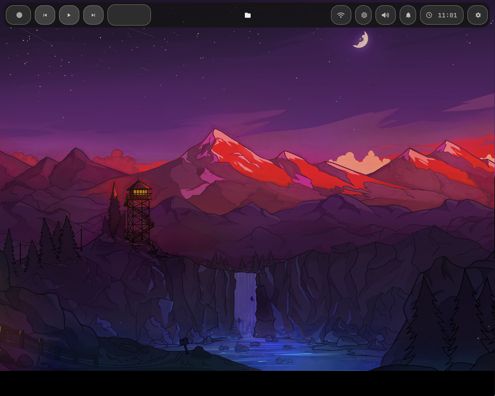
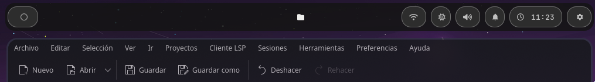
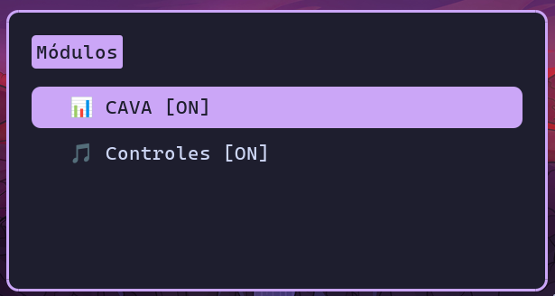
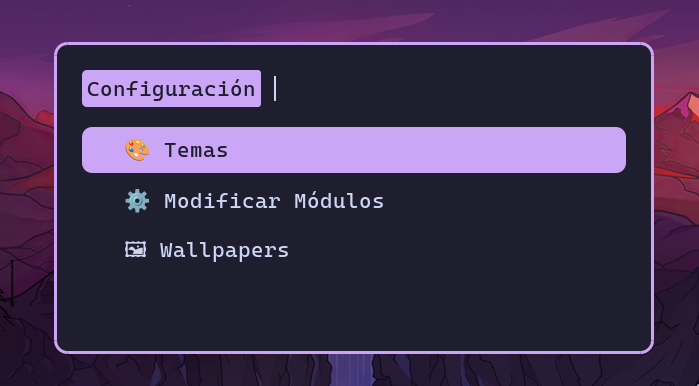
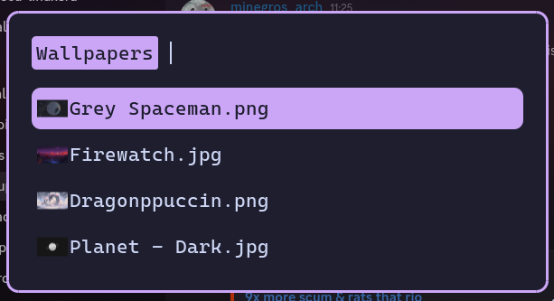

🟣 NeoSleceWay

NeoSleceWay es un panel superior minimalista y moderno para Waybar, diseñado para usuarios de Sway/Hyprland.
Centraliza música, sistema y aplicaciones con diseño elegante, colores translúcidos y bordes redondeados.

🚀 Características Principales
💻 Sistema
Red Wi-Fi con SSID visible y gestión desde Waybar
Controles de volumen integrados
Brillo de pantalla ajustable
Notificaciones desplegables
Reloj y fecha con estilo

🎵 Música
Carátula de la canción actual (actualización automática)
Botones: Anterior, Reproducir/Pausar, Siguiente
Tiempo restante de la canción
Título y artista de la canción
⚠️ Importante: Los scripts dentro de ~/.config/waybar/scripts/ son críticos.
No modificar: memory.py, update_cover.py, playerctl.py
Alterarlos puede romper la actualización de carátulas, controles de música y tiempo de canción.
Haz backup antes de cualquier cambio.

📋 Clipboard / Portapapeles
Visualiza imágenes y texto
Copia al portapapeles con un clic
Vaciar portapapeles desde Rofi

⚙️ Configuración de Módulos
Activa o desactiva:
Visualizador de audio (CAVA)
Controles de música
Notificaciones
Workspaces
Personalización fácil vía Rofi

🖼 Wallpapers
Selección y previsualización de fondos desde Rofi
Compatible con imágenes .jpg, .png, .jpeg
Cambia el wallpaper automáticamente con aww

📂 Funciones por Script
Script	Función
cava.py	Visualizador de audio con barras híbridas vertical/lateral
playerctl.py	Control de música: play/pause, next, previous
update_cover.py	Actualiza automáticamente la carátula de la canción
wifi_manager.sh	Escaneo y conexión Wi-Fi, olvidar redes
clipboard.sh	Gestión de portapapeles, previsualización de imágenes/texto
notes.sh	Crear, editar y eliminar notas rápidas
wallpapers.sh	Gestión y cambio de wallpapers desde Rofi
🎨 Estética
Bordes redondeados y fondo translúcido
Tema inspirado en Catppuccin Mocha
Animaciones suaves y deslizamiento de elementos
Fuente: DaddyTimeMono Nerd Font
⚡ Instalación
git clone https://github.com/tuusuario/NeoSleceWay.git ~/.config/waybar
chmod +x ~/.config/waybar/scripts/*.sh
chmod +x ~/.config/waybar/scripts/*.py
Configura tus temas CSS
Personaliza ~/.config/cava/config_waybar si quieres ajustes visuales del visualizador
Inicia Waybar y los scripts se integrarán automáticamente
📦 Dependencias
sudo apt install cava rofi nmcli wl-clipboard pavucontrol aww playerctl mousepad
cava → Visualización de audio
rofi → Menús y selección
nmcli → Gestión de redes
wl-clipboard → Portapapeles Wayland
pavucontrol → Control de volumen
aww → Cambiar wallpapers en Wayland
playerctl → Controlar reproductores
mousepad → Editor de notas

